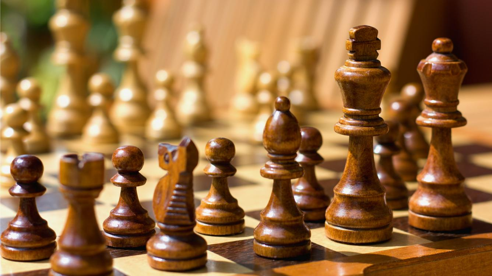
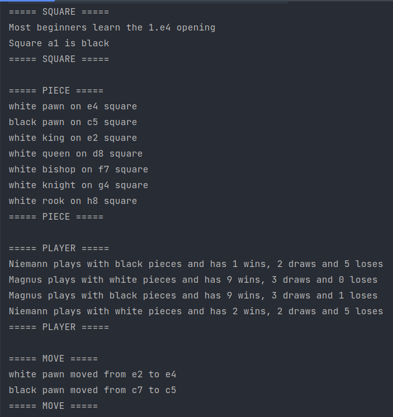
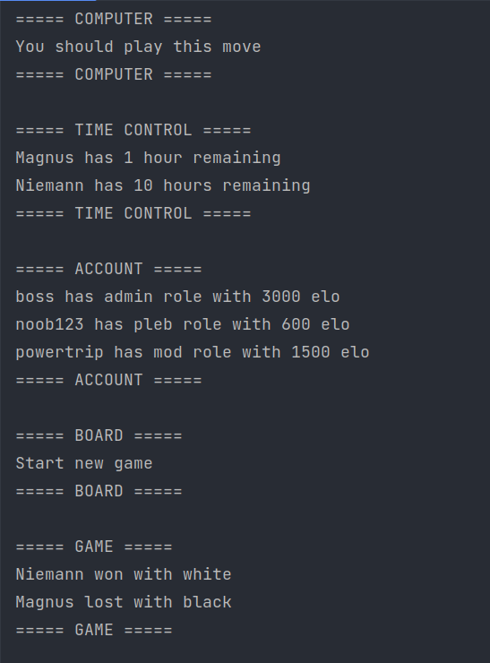
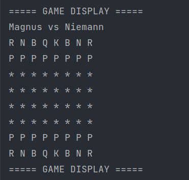

# Lab 2: Into OOP and Encapsulation

## 0. What is chess?

Chess is an abstract strategy game and involves no hidden information. It is played on a square chessboard with 64 squares arranged in an eight-by-eight grid.

At the start, each player (one controlling the white pieces, the other controlling the black pieces) controls sixteen pieces: one king, one queen, two rooks, two bishops, two knights, and eight pawns. The object of the game is to checkmate the opponent's king, whereby the king is under immediate attack (in "check") and there is no way for it to escape. There are also several ways a game can end in a draw.

## 1. Implementation

In order to implement a chess simulation the following entities will be used:

1. Game
2. GameDisplay
3. Board
4. Square
5. Piece
6. Move
7. Player
8. Computer
9. Account
10. TimeControl

### 1.1 Game

It is responsible for keeping track of the moves, whose turn is at the moment and the final result of the game.

### 1.2 GameDisplay

Concerning the view of the game this shows the current position of the chess match

### 1.3 Board

This contains the 8x8 board consisting of 64 squares.

### 1.4 Square

Each individual square depicts a position of a piece, ranging from a1 to h8

### 1.5 Piece

Using this class, we create the chess pieces: King, Queen, Pawn, Rook, Bishop and Knight

### 1.6 Move

This is to ensure legal and special moves for each of the pieces.

### 1.7 Player

It is the participant of the game and keeps track which side a particular player is playing

### 1.8 Computer

A player can play with a bot opponent.

### 1.9 Account

This will show individual statistics, leaderboards and different type of users

### 1.10 TimeControl

Each chess game is played under a time control, be it a traditional or custome one.

## 2. Results

