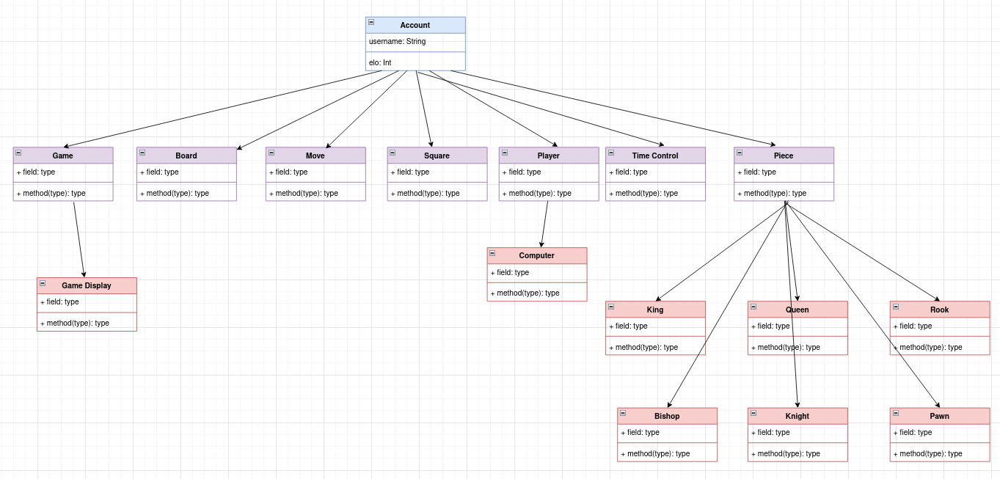

# Lab 3: Into OOP and Inheritance

## 1. Diagram analysis

**Account** is the root/God class. Each sub-class is going to include the username and ELO fields of the super-class. Since a profile is the top level of a chess application/simulation, naturely it will be included in **all** subclasses.

**GameDisplay** inherits **Game** which in turn means direct access provided to an instance of **Game**. Displaying each player's move and providing a visual of what's happening on the board it is a crucial entity of the simulation.

**Piece** is a key super-class. It has the most sub-classes such as: King, Queen, Rook, Bishop, Knight and Pawn. As an application of inheritance, each piece has overided the piece movement method.

Last but not least, a sub-class of **Player** is **Computer**. Not playing against another human, but a computer is an essential feature of the game.
