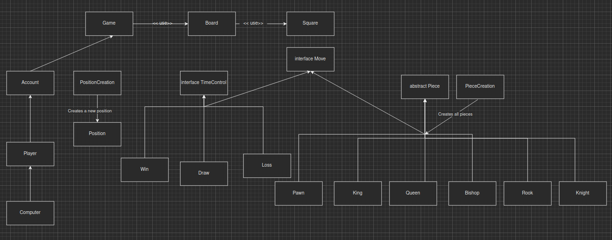

# Lab 4: Into OOP and Polymorphism

## 1. Diagram analysis

**Game** class doesn't inherit **Board** or **Square**, but merely uses it inside the file.

**Computer** can be a player and can also have its own designated **Account**. Player might or might not posses an **Account**.

**PositionCreation** is the type of class to update/create a new position easier.

**TimeControl** represents how much time each player has and depending on that we have 3 outcomes:

1. **Win**
2. **Loss**
3. **Draw**

Besides this these outcomes can be achieved through **Move** interface, that is a player got either checkmated, stalemated, resigned or other result has occured.

Arguably the most important entity, the abstract class **Piece**. Since there is no need to instantiate it, it's the perfect to make it abstract. Obviously, all chess pieces inherit this class:

- **King**
- **Queen**
- **Rook**
- **Bishop**
- **Knight**
- **Pawn**

On top of that these classes make use of the **Move** interface to make their usual moves.
