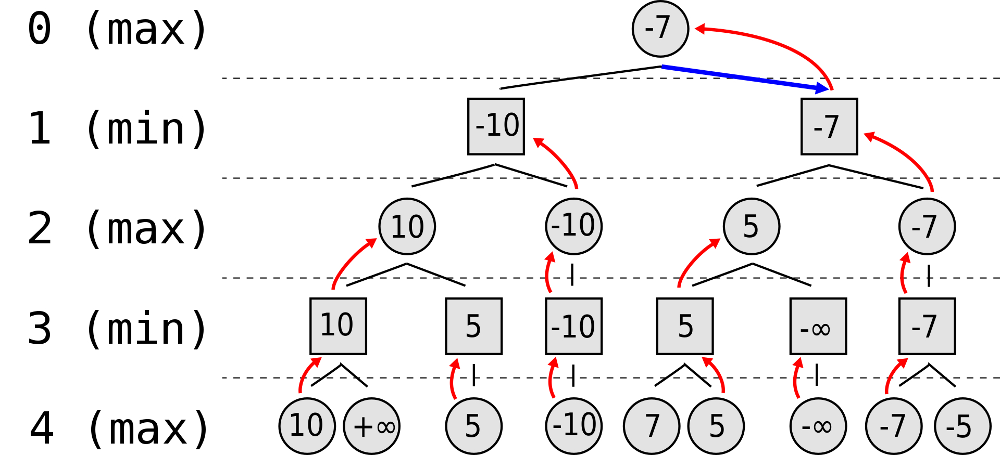

# Lab 5: Wrapping Up the Simulation

## 1. What is Chess AI?

Computer chess applications, whether implemented in hardware or software, utilize different strategies than humans to choose their moves: they use heuristic methods to build, search and evaluate trees representing sequences of moves from the current position and attempt to execute the best such sequence during play. Such trees are typically quite large, thousands to millions of nodes. The computational speed of modern computers, capable of processing tens of thousands to hundreds of thousands of nodes or more per second, along with extension and reduction heuristics that narrow the tree to mostly relevant nodes, make such an approach effective.

## 2. How to implement one?

There are several routes to take if you want to build a Chess AI:

- Search based (brute force vs selective search)

1. Search in search based schema (minimax/alpha-beta, Monte Carlo tree search)
2. Evaluations in search based schema (machine learning, neural networks, texel tuning, genetic algorithms, gradient descent, reinforcement learning)

- Knowledge based (PARADISE, endgame tablebases)

## 3. Minimax Implementation

Minimax is a decision rule used in artificial intelligence, decision theory, game theory, statistics, and philosophy for minimizing the possible loss for a worst case (maximum loss) scenario. When dealing with gains, it is referred to as "maximin" – to maximize the minimum gain. Originally formulated for several-player zero-sum game theory, covering both the cases where players take alternate moves and those where they make simultaneous moves, it has also been extended to more complex games and to general decision-making in the presence of uncertainty.

## 3.1. Example

Suppose the game being played only has a maximum of two possible moves per player each turn. The algorithm generates the tree on the right, where the circles represent the moves of the player running the algorithm (maximizing player), and squares represent the moves of the opponent (minimizing player). Because of the limitation of computation resources, as explained above, the tree is limited to a look-ahead of 4 moves.

The algorithm evaluates each leaf node using a heuristic evaluation function, obtaining the values shown. The moves where the maximizing player wins are assigned with positive infinity, while the moves that lead to a win of the minimizing player are assigned with negative infinity. At level 3, the algorithm will choose, for each node, the smallest of the child node values, and assign it to that same node (e.g. the node on the left will choose the minimum between "10" and "+∞", therefore assigning the value "10" to itself). The next step, in level 2, consists of choosing for each node the largest of the child node values. Once again, the values are assigned to each parent node. The algorithm continues evaluating the maximum and minimum values of the child nodes alternately until it reaches the root node, where it chooses the move with the largest value (represented in the figure with a blue arrow). This is the move that the player should make in order to minimize the maximum possible loss.
